Commerce Order Item Addon
==========================

Allows any renderable entity to bundle with a product variation making it a
purchasable entity type.

> Tip: you can see this file in your browser by clicking
the [admin/help#](#0 "? Help") link at the right of the *Admin toolbar* and then
the [admin/help/commerce_oiaddon#](#0 "Commerce Order Item Addon") link in
the list.

The examples of the entities are: _node_, _taxonomy term_, _user_, _profile_,
_commerce product_, _product variation_, _variation attribute_ or a
custom entity type provided by other contrib modules. To enable this
functionality you need to add the **Order item addon price** field to a
desirable entity type:


The field allows to add the pseudo price to entities of a type. If the price is
zero, which is the default value, then the purchasable entity will be considered
as a free addon and will not modify an order item price. Otherwise, the
value will be added to, or subtracted from the currently viewing product
variation price as a fixed amount value or a calculated percentage:


## View mode

Optionally, you
can [admin/structure/display-modes/view/add#](#0 "create an entity type view mode") specifically
intended for displaying / hiding desirable entity fields on a product variation
page. Or, you can use an existing view mode:

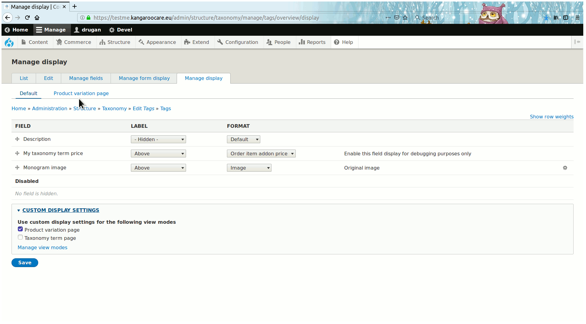

Then go to a desirable order item type edit page and add any of the enabled
purchasable addon types to it. The process is pretty much the same as adding to,
or deleting from, variation attributes on a variation type edit page:

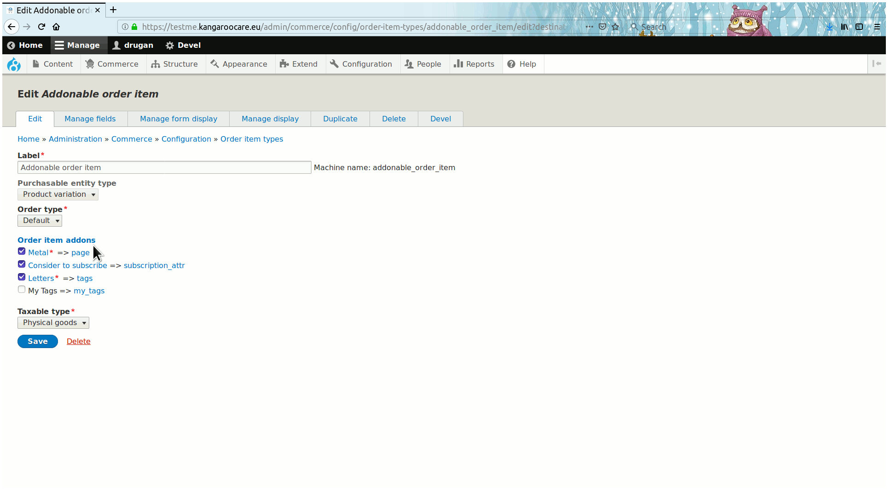

When an addon type is saved on the order item type then you can click the link
on the right side to go to the addon type edit page or on the left to go to the
addon reference field edit page. Here you can change the field label, whether it
is required and a reference method which could be either a direct reference to
an entity type or entity reference view of the entities, optionally filtered by
any views' recognizable condition. Note that in the case if multiple direct
reference checkboxes are checked then all the entities of these addon types will
be combined and optionally can be divided into different optgroup options on the
on the Add to cart form select list keyed by the addon entity type label.


After that go to the addon field widget settings on the Add to cart view mode.
A widget could be either a select list or radio buttons. The settings for both
the widgets are identical:


The order item addon content can be optionally displayed on
an _Add to cart_ form as ajax refreshable along with the addon's pseudo price.
Note that in case if the price is of a percentage type then it will be
recalculated each time when a variation with different price is dispalyed for a
customer on the form:

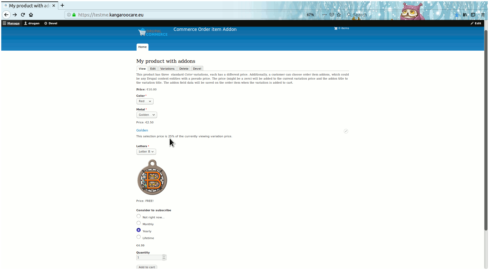

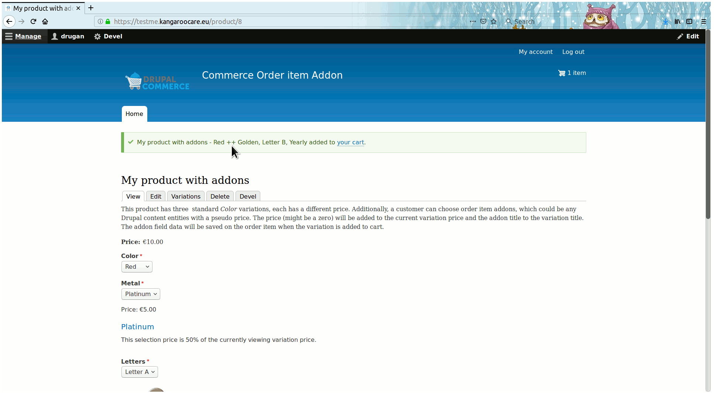


________________________________________________________________________________


## Bundled terms labels clue string

The string to [admin/help/commerce_oiaddon#bundle-child-terms](#bundle-child-terms
"Bundle child terms").


## Addon labels clue string


## Titles clue string

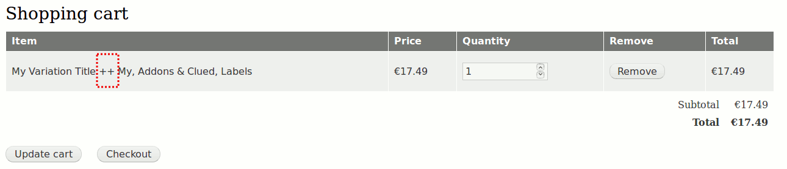

## Empty option label

The optional addon field empty option label. Being selected removes any content
displayed on a previously selected option.

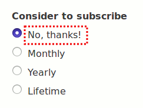

## Zero price label

The text to display instead of a **€0.00** price value.

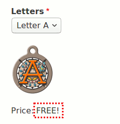

## Bundle child terms

In the case if taxonomy terms are used as an order item addon then a parent ->
child term labels will be concatenated using
the [admin/help/commerce_oiaddon#bundled-terms-labels-clue-string](#bundled-terms-labels-clue-string
"Bundled terms labels clue string"). Also, all the parent and chidren terms
prices will be added together into one price. That way you can easily create
addon bundles by using drag-n-drop feature of a vocabulary taxonomy terms
overview page.

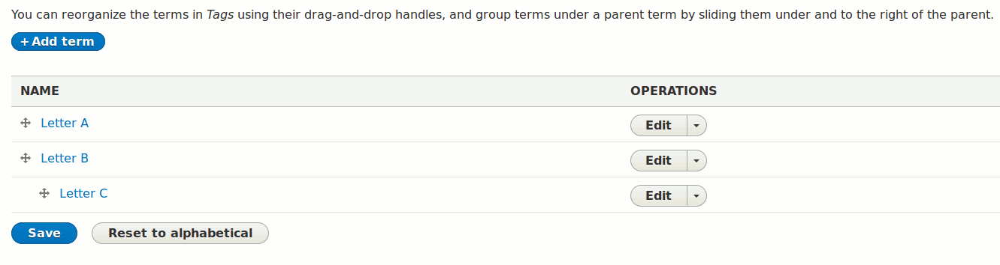


## Opt group labels

Addon entities of the same type can be combined on any of the earlier saved
addons. See **tags** and **my_tags** taxonomy vocabulary addons:

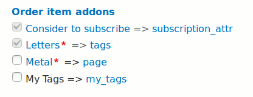

Let's click the [admin/help/commerce_oiaddon#0](#0 "Letters") link and
combine **My Tags** with **Tags** vocabulary:


See the combined options divided into opt groups keyed by vocabulary labels.
Note that opt group labels will not be displayed on
the _Order item addon radio buttons_ widget.

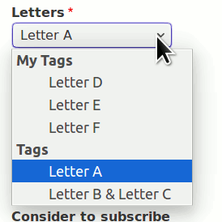

## Display price label

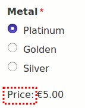

## Display rendered addon name

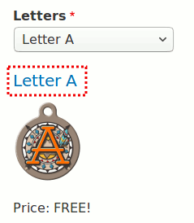

## View reference type

Additionally to direct reference (checkboxes) the addon entity types can be also
referenced by _entity reference view_ views display. Just create new or use
existing view of the purchasable addon types. Then filter the views display by
any views aware condition and then choose that view on the order item addon
field edit page.

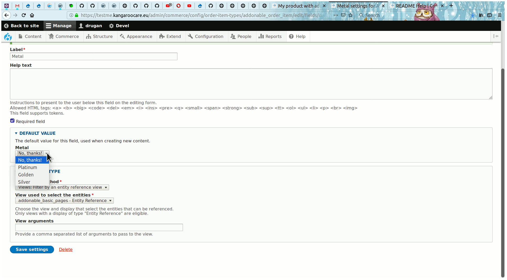

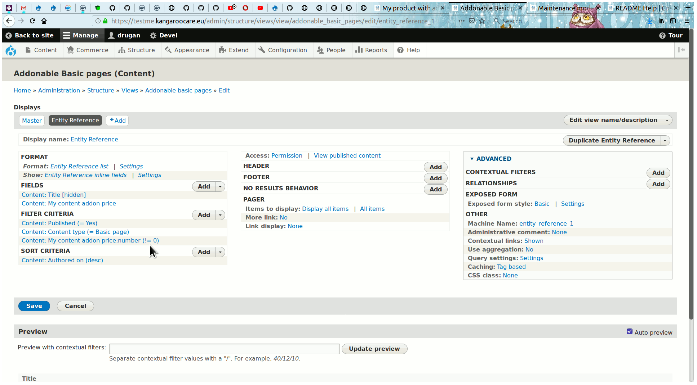


###### Module author:
```
  Vlad Proshin (drugan)
  [proshins@gmail.com](proshins@gmail.com)
  [https://drupal.org/u/drugan](https://drupal.org/u/drugan)
```
